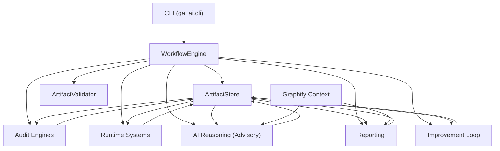

# QA-AI Architecture Overview

QA-AI is an autonomous software audit and improvement infrastructure built around deterministic workflow execution, artifact contracts, and safety-gated planning. The system coordinates audit engines, runtime systems, distributed/mobile simulation layers, reporting, and continuous improvement through a shared artifact memory.

## Layer model

1. CLI: `qa_ai.cli.main` parses commands (`audit`, `report`, `doctor`, `benchmark`, `runtime-lab`, `distributed-runtime`, `mobile-runtime`, `ai-reasoning`) and routes to `AuditCommand`.
2. WorkflowEngine: `qa_ai.orchestration.workflow_engine.WorkflowEngine` orchestrates phase execution and lifecycle state.
3. ArtifactStore: `qa_ai.runtime.artifact_store.ArtifactStore` is the shared system memory for all agents/phases.
4. ArtifactValidator: `qa_ai.artifacts.artifact_validator.ArtifactValidator` enforces/normalizes known artifact contracts and safe fallbacks.
5. Audit engines: discovery, planning, execution, API/security/code/dependency/release checks, runtime validation, RCA.
6. Runtime systems:
   - Runtime lab planning and live benchmark orchestration
   - Live execution trace/network/replay pipelines
   - Distributed runtime simulation
   - Mobile runtime planning and monitoring
7. AI reasoning: deterministic-first advisory layer (`AIReasoningOrchestrator`) with fallback mode when model is unavailable.
8. Reporting: summary/dashboard/visualization/export generators.
9. Improvement loop: health scoring, fix planning, retest orchestration, regression guard, learning registry.

## Core architectural rule

Subsystems communicate through versioned artifacts in `ArtifactStore`, not direct in-memory coupling. This keeps phase boundaries explicit, testable, and safe to evolve.
